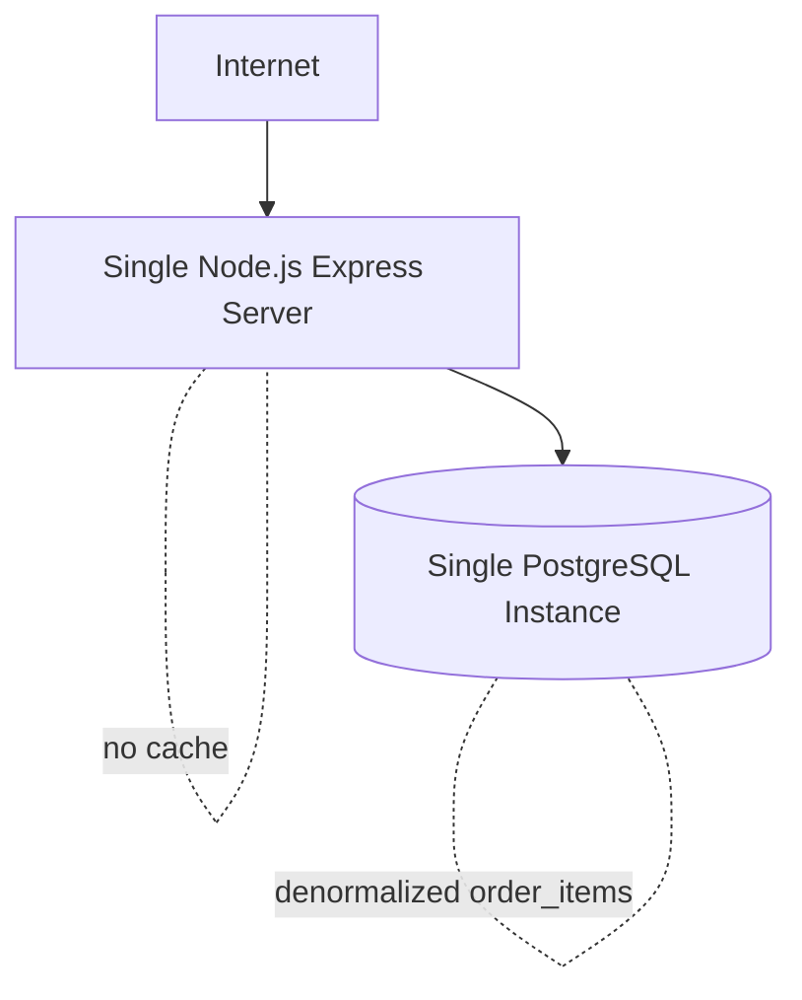
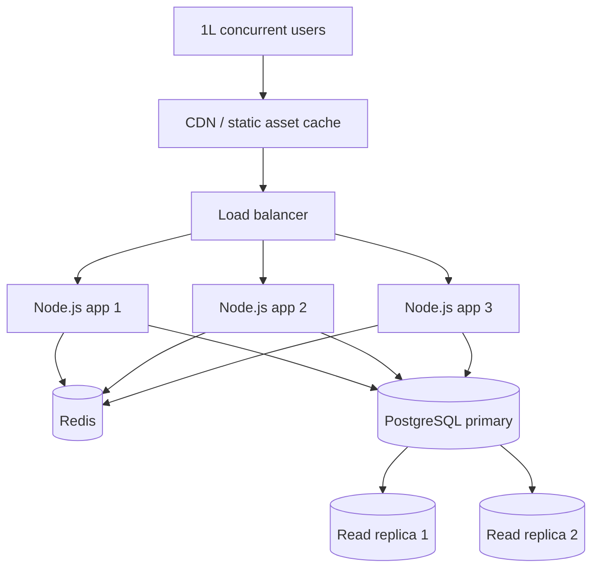

# Part B - Architecture Redesign

This document connects the Part A findings to the Part B design and implementation.

## Current Architecture



### Weaknesses observed in Part A

- Single point of failure: one app process, one DB server.
- No caching: product reads always hit PostgreSQL.
- No read/write separation: reads and writes contend on the same primary.
- No static asset layer: product images and catalog traffic compete with API work.
- Denormalized order items: duplicated product data in order history.
- Missing constraints and indexes: integrity gaps and slow user/order lookups.

## Scaled Architecture



### Design choices

- Load balancer: removes single-process failure and spreads traffic horizontally.
- Stateless app instances: keeps session logic in token/DB-backed layers, not memory.
- CDN: offloads images and other static assets.
- Redis: best fit for short-lived catalog data, distributed locks, and hot session-adjacent data.
- Read replicas: keep read-heavy lookups away from write pressure.
- PostgreSQL primary: remains the source of truth for transactional writes.

### Redis vs `SELECT ... FOR UPDATE` for coupons

`SELECT ... FOR UPDATE` is valid for atomic coupon use inside PostgreSQL, and this codebase already uses it in checkout. Redis becomes the better fit when the lock must coordinate across app nodes, when a fast distributed gate is needed before touching the database, or when the same mechanism also supports cache/session patterns. The tradeoff is operational complexity: Redis adds another service to deploy, monitor, and back up. For this repo, PostgreSQL row locking is sufficient for coupon safety, while Redis is the right extension if catalog caching is added later.

## Normalized Schema

### Core tables

- `users`: `name`, `email`, `password`, `phone`, `role`, `created_at`
- `categories`: catalog grouping table
- `products`: catalog master data with `category_id`, `price`, `stock`, and `image_url`
- `orders`: user-owned order header with `status`, `total_amount`, `discount`, `shipping_address`
- `order_items`: normalized line items with `product_id`, `unit_price_at_purchase`, `quantity`
- `coupons`: single-use coupons with expiry and `used` flag

### Constraints and indexes

- `NOT NULL` on required columns to prevent orphaned or incomplete rows.
- `CHECK (stock >= 0)` and `CHECK (quantity > 0)` to enforce inventory rules.
- `CHECK` on `role` and `status` to limit values to known states.
- Foreign keys with delete behavior to prevent orphaned child rows.
- Composite indexes:
  - `orders(user_id, created_at DESC, id DESC)` for order history.
  - `products(category_id, created_at DESC)` for browsing.
  - `order_items(order_id, created_at ASC, id ASC)` for joined order rendering.

## REST API Contracts

### Standard error shape

All errors now use one format:

```json
{
  "success": false,
  "error": {
    "code": "VALIDATION_ERROR",
    "message": "Email and password are required"
  }
}
```

### Endpoint summary

- `GET /api/health`
  - Response: server status payload.
- `GET /api/products`
  - Query: `search`, `category`, `limit`, `offset`.
  - Response: product list with count.
- `GET /api/products/:id`
  - Response: one product or `404` if missing.
- `POST /api/auth/register`
  - Body: `name`, `email`, `password`, optional `phone`.
  - Response: JWT, user profile.
- `POST /api/auth/login`
  - Body: `email`, `password`.
  - Response: JWT, user profile.
- `GET /api/orders/history`
  - Auth required.
  - Query: `limit`, `offset`.
  - Response: paginated order history with items.
- `POST /api/cart/checkout`
  - Auth required.
  - Body: `items`, `couponCode`, `shippingAddress`.
  - Response: order header, line items, discount.
- `PATCH /api/orders/:id/status`
  - Admin auth required.
  - Body: `status`.
  - Response: updated order.

## Optimization Implemented

### Chosen optimization: composite index on order history

The query path for order history is now aligned with the database access pattern:

- Filter by `user_id`.
- Sort by `created_at DESC, id DESC`.
- Paginate the order list before joining items.

This is the lowest-risk measurable optimization for the current codebase because it requires no new infrastructure and directly addresses the slow history lookup from Part A.

### Benchmark format

Run this locally against a seeded database and paste your measured values into the table.

See `scripts/benchmark_order_history.sql` for the exact query path to measure before and after the composite index.

**What was optimized:** order history lookup with `orders(user_id, created_at DESC)`

**Test conditions:**
- Tool: `EXPLAIN ANALYZE`
- Data set: seeded local database
- Query: `GET /api/orders/history?limit=10&offset=0`

| Metric | Before | After |
|---|---:|---:|
| Plan shape | Seq Scan on `orders` | Index-backed lookup on `orders` |
| Rows touched | Full user order set | Limited page window |
| Query time | Capture locally | Capture locally |

## Files Updated

- `src/migrations/001_create_tables.sql`
- `src/controllers/checkout.controller.js`
- `src/controllers/order.controller.js`
- `src/controllers/auth.controller.js`
- `src/controllers/product.controller.js`
- `src/middleware/auth.middleware.js`
- `src/utils/api-response.js`
- `scripts/generate_seed.js`
- `src/seeds/seed.sql`

## Summary

The code now reflects the Part B direction: normalized schema, consistent REST errors, paginated order history, and an index-backed optimization path that can be benchmarked locally.
